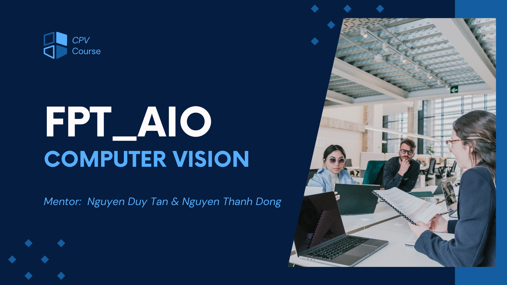

<div align="center">
  <p>
    <a href="https://yolovision.ultralytics.com/" target="_blank">
      </a>
  </p>

<br>

FPT_AIO is a computer vision course under the guidance of two experienced mentors in the field of AI, [Mr. Tan]() and [Mr. Dong](). The course will cover fundamental knowledge about ML & DL, followed by the latest technologies and processing methods in Computer Vision.

The knowledge from the course can address most of the current computer vision problems such as: classification, detection,... In addition, you will also learn about methods to improve model accuracy, such as tuning, and gain a deeper understanding of optimization algorithms.

</div>


## <div align="center">AI Syllabus</div>

- **Topic 1: Introduction to DL and CV**
  + **Day 1:** Introduction to Deep Learning and Neural Networks
  + **Day 2:** Introduction to Convolutional Neural Networks (CNNs)

- **Topic 2: Object Classification**
  + **Day 3:** Images Classification with CNNs
  + **Day 4:** Transfer Learning and Fine-Tuning
  + **Day 5:** Handling Imbalanced Datasets
  + **Day 6:** Sharing about Advanced Techniques for Object Classification
  + **Day 7:** Optimize model using ONNX and TensorRT

- **Topic 3: Object Detection**
  + **Day 8:** Introduction to Object Detection
  + **Day 9:** Single-stage Object Detection: YOLO
  + **Day 10:** Two-stage Object Detection: Faster R-CNN
  + **Day 10 (Optional):** State-of-the-Art (SOTA) for Object Detection Problem

- **Topic 4: Image Segmentation**
  + **Day 11:** Introduction to Image Segmentation
  + **Day 12:** CNN for Segmentation
  + **Day 13:** Advanced Segmentation Techniques
  + **Day 14:** Evaluation and Metrics for Segmentation

- **Topic 5: Multi-modal Transformers**
  + **Day 15:** State-of-the-art in Natural Language Processing (NLP)
  + **Day 16:** State-of-the-art in Computer Vision (CV)
  + **Day 17:** Image2Text
  + **Day 18:** Text2Image
  + **Day 19:** Multi-modal model
  + **Day 20:** Advanced techniques to speed up training


## <div align="center">Documentation</div>


<details open>
<summary>Install</summary>

Pip install the package including all [requirements](requirement.txt) in a [**Python>=3.8**](https://www.python.org/) environment with [**PyTorch>=1.8**](https://pytorch.org/get-started/locally/).

```bash
pip install -r requirements.txt
```
<details open>
<summary>Document</summary>
Silde and code demo 


```bash
git clone https://github.com/dinhanit/AIO_CPV.git
cd Document
```


## <div align="center">Contact</div>

For Ultralytics bug reports and feature requests please visit [GitHub Issues](https://github.com/ultralytics/ultralytics/issues), and join our [Discord](https://ultralytics.com/discord) community for questions and discussions!

<br>
<div align="center">
  <a href="https://github.com/dinhanit" style="text-decoration:none;">
    </a>

